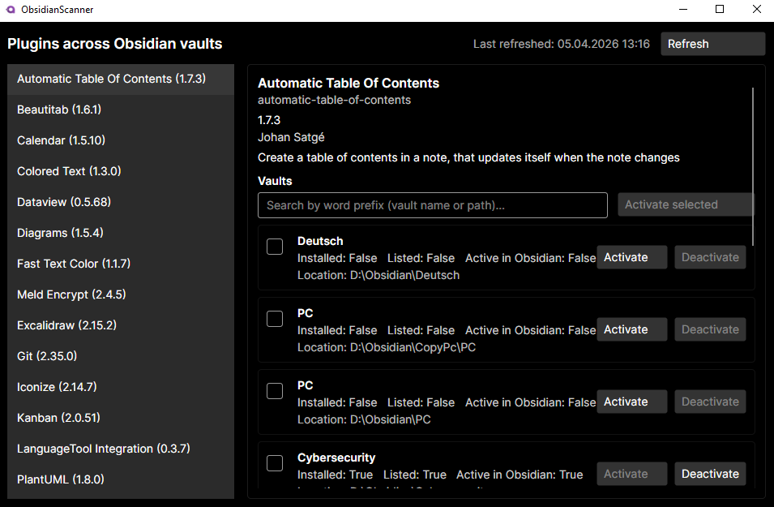

# Obsidian Plugin Manager

The app helps you manage your community plugins across multiple vaults from one place.



## Features

1. **Discover vaults and plugins** - Vaults come from the Obsidian desktop app’s config (`%APPDATA%\Obsidian\obsidian.json`). The app builds a single list of **unique** community plugins by combining what each vault has enabled on disk (`community-plugins.json`) and what appears under each vault’s `.obsidian/plugins` folder (including folders without a manifest).

2. **Activate and deactivate per vault** - For a chosen plugin you can turn it **on** for a vault (copy plugin files when needed, then add it to that vault’s enabled list) or **off** (remove it from the enabled list; files on disk are left as-is).

3. **Plugin details** - For each plugin you see name, id, version, author, and description (from the plugin manifest when available).

4. **Status per vault** - For every vault you see whether the plugin is **installed** (folder present), **listed** as enabled in that vault’s config, and whether Obsidian will actually **run** it. If the vault is in **Restricted mode**, listed plugins still won’t load until you change that in Obsidian’s settings.

5. **Vault location** - Each row shows the vault’s folder path so you know exactly which vault you’re acting on.

6. **Bulk actions** - Tick several vaults and **activate** them in one go when they’re eligible.

7. **Optional plugin data** - When activating, you can choose to bring over the plugin’s `data.json` from another vault when that data exists (useful for settings-backed plugins).

8. **Search vaults** - Narrow the vault list by typing a **prefix** that matches the **start** of a word in the vault name or path (not arbitrary substrings in the middle of a word). Words are split sensibly along path separators and common name boundaries.

9. **Vault order** - Vaults where the plugin is **not** yet installed are listed first; then vaults that already have it. Within each group, names are sorted alphabetically.

10. **Refresh** - Rescan everything from disk; the UI shows when the data was last refreshed.

## Requirements

Obsidian for **desktop**, with at least one vault registered so Obsidian has written its vault list. The app is a small **Windows** desktop UI (Avalonia); running on other OSes would require building for those targets.

## Safety

Prefer trying activate/deactivate on a **copy** of a vault first. The app edits `community-plugins.json` and may copy files under `.obsidian/plugins`.

## Build and run

```bash
dotnet build ObsidianScanner/ObsidianScanner.csproj
dotnet run --project ObsidianScanner/ObsidianScanner.csproj
```
